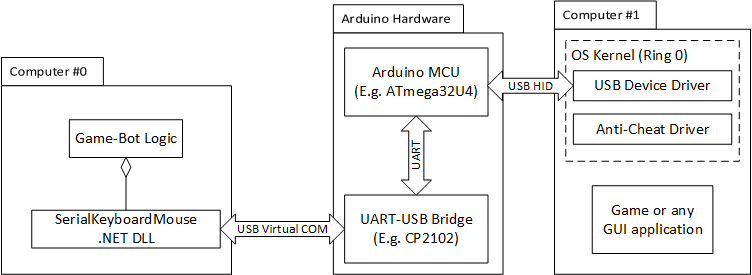
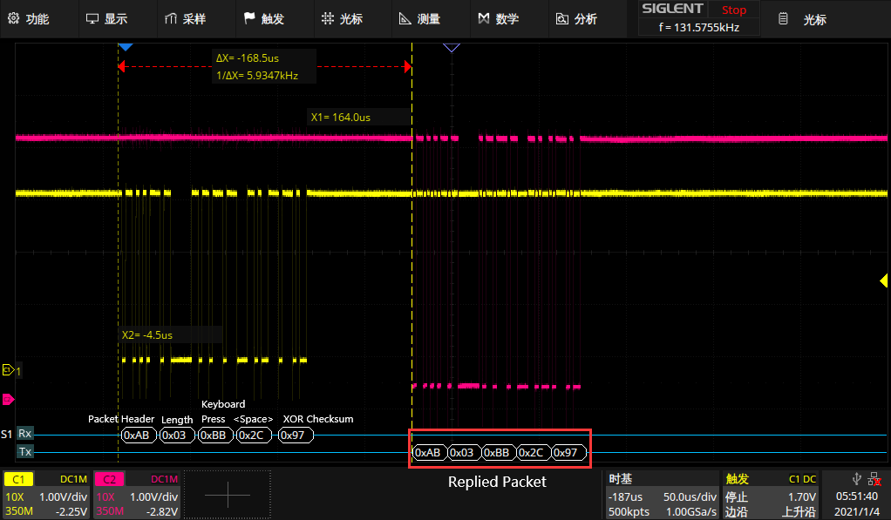

# SerialKeyboardMouseController
A software-controlled hardware USB HID keyboard &amp; mouse for everyone

* [Purpose](#purpose)
* [Build Hardware](#build-hardware)
* [Software Deployment](#software-deployment)
* [Notes](#notes)
* [Serial Protocol](#serial-protocol)
* [License](#license)

## Purpose
This is an Arduino project with a .NET library allowed you to control a **real** hardware mouse &amp; keyboard without being detected by any anti-cheat or protection software. Since this system is using a real USB HID device, it’s very hard to distinguish it from normal mouses and keyboards.



## Build Hardware
**Materials:**

* An Arduino device with [`HID.h`](https://www.arduino.cc/en/Reference/HID) implemented. ATmega32U4 boards like Micro and Leonardo, or SAMD board like MKR ZERO would work.
* An UART-To-USB bridge, like CP2102N, FT232R, CH340, etc..

**Step:**
1. Make sure your Arduino is tolerant with your UART-USB bridge logic level (5V or 3.3V). :warning:
2. Connect Arduino **GND** -> UART-USB bridge **GND** (VCC is not necessarily connected)
3. Connect Arduino **TX** -> UART-USB bridge **RX**
4. Connect Arduino **RX** -> UART-USB bridge **TX**
5. Upload [SerialKeyboardMouseController.ino](SerialKeyboardMouseController/src/SerialKeyboardMouseController.ino) to your Arduino board.
6. (Optional) Modify [serial_symbols.h](SerialKeyboardMouseController/src/serial_symbols.h)
and [SerialSymbols.cs](SerialKeyboardMouse/Serial/SerialSymbols.cs) to change baud rate. 
Be aware of baud rate timing error. Most Arduino boards are running at 16Mhz, so `500000` is a reasonable value without any clock error. 
7. Connect Arduino to target computer, connect UART-USB bridge to controller computer.

## Software Deployment
[SerialKeyboardMouse](https://github.com/charlescao460/SerialKeyboardMouseController/tree/main/SerialKeyboardMouse) is a .NET library. 
It is cross-platform, with serial driver supported by .NET's `System.IO.Ports` package. So you can deploy it to a embedded Linux device, implementing an Edge AI game-bot.

A demo program [SerialKeyboardMouseConsole](https://github.com/charlescao460/SerialKeyboardMouseController/tree/main/SerialKeyboardMouseConsole) was written in WinForms, 
which will transfer all received mouse & keyboard events to the target.


## Notes
Some protection software will check USB VID and PID, to avoid being detected, consider changing them in Arduino’s [Core Library](https://github.com/arduino/ArduinoCore-avr/blob/master/cores/arduino/USBCore.cpp). Most operation systems will have a general driver for HID devices, so changing VID & PID won’t involve driver issue.

Recently, there are some reports about anti-cheat programs checking COM ports attached to the keyboard and mouse USB devices. To avoid being detected, we should disable its [USB CDC configuration](https://github.com/arduino/ArduinoCore-avr/blob/master/cores/arduino/USBDesc.h).

Most anti-cheat will not judge you even if they know you are using an Arduino as keyboard. There are many DIY keyboards out there using Arduino. However, if you want some mental relief, consider passing below preprocessor defines when building Arduino projects:
```bash
-DCDC_DISABLED # Disable CDC (no virtual COM port)
-DUSB_VID=0x0111 # Your VID 
-DUSB_PID=0x0111 # Your PID
-DUSB_PRODUCT=\"Your Product Name\"
-DUSB_MANUFACTURER=\"Your Manufacturer Name\"
```

Also, be aware of [Keystroke dynamics](https://en.wikipedia.org/wiki/Keystroke_dynamics). There are many published literatures describing the unique pattern of typing for each individual. So, theoretically a machine learning pattern-recognition algorithm can detect suspicious keyboard operation. Or even a unsupervised machine learning model can separate automated inputs from real-user inputs. Try to add some random delays between each HID report. If you send commands too fast, it will definitely trigger the anti-bot protection. 

## Serial Protocol
USB-related communication should be reliable for most UART-USB bridge. Therefore, the only uncertainty is UART transmission. The serial communication is done by transmitting packets.

Packets are variable-length, starting with preamble `0xAB`, followed by 1-byte length, after length is body, and the last byte is XOR checksum. If the Arduino device successfully received the packet and sent desired HID report, it will loop back the packet (i.e., send a packet with exact contents). If there’s anything wrong, it won’t send anything back. Controller library will then detect this timeout and try again. 

Serial protocol is detailed in [serial_symbols.h](SerialKeyboardMouseController/src/serial_symbols.h).



The image showed above is an example of transmitting packets when `<Space>` was pressed on Arduino Micro.  

The packet starts with `0xAB`, followed by length `0x03`, indicating that there are 3 bytes remaining in this packet. 

`0xBB` means ` FRAME_TYPE_KEY_PRESS`. 

`0x2C` is the HID scan code of key `<Space>`. 

The last byte `0x97` is the check sum of previous 2 bytes (starting after length). 

After the Arduino successfully sent HID report, it sent an exact same packet back, so the software knows it succeeded. 

As shown in oscilloscope, even with a relative low-speed 16MHz ATmega32U4, the packet processing and USB reports are nearly done immediately. The main bottleneck is UART, so the higher baud rate is better. Besides, since Arduino Micro has only 32 bytes serial input buffer, it will be easily overflowed by frequent requests. 


## License
**GNU Lesser General Public License** (LGPL)

Because [Keyboard.cpp](SerialKeyboardMouseController/src/Keyboard.cpp) and [Keyboard.h](SerialKeyboardMouseController/src/Keyboard.h) are based on Arduino's [Keyboard](https://github.com/arduino-libraries/Keyboard) library. If you can get rid of it by writing your own library, or if you don't need Arduino sketch, feel free to use this MIT License:
```text
MIT License

Copyright (c) 2021 Charles Cao

Permission is hereby granted, free of charge, to any person obtaining a copy
of this software and associated documentation files (the "Software"), to deal
in the Software without restriction, including without limitation the rights
to use, copy, modify, merge, publish, distribute, sublicense, and/or sell
copies of the Software, and to permit persons to whom the Software is
furnished to do so, subject to the following conditions:

The above copyright notice and this permission notice shall be included in all
copies or substantial portions of the Software.

THE SOFTWARE IS PROVIDED "AS IS", WITHOUT WARRANTY OF ANY KIND, EXPRESS OR
IMPLIED, INCLUDING BUT NOT LIMITED TO THE WARRANTIES OF MERCHANTABILITY,
FITNESS FOR A PARTICULAR PURPOSE AND NONINFRINGEMENT. IN NO EVENT SHALL THE
AUTHORS OR COPYRIGHT HOLDERS BE LIABLE FOR ANY CLAIM, DAMAGES OR OTHER
LIABILITY, WHETHER IN AN ACTION OF CONTRACT, TORT OR OTHERWISE, ARISING FROM,
OUT OF OR IN CONNECTION WITH THE SOFTWARE OR THE USE OR OTHER DEALINGS IN THE
SOFTWARE.
```
